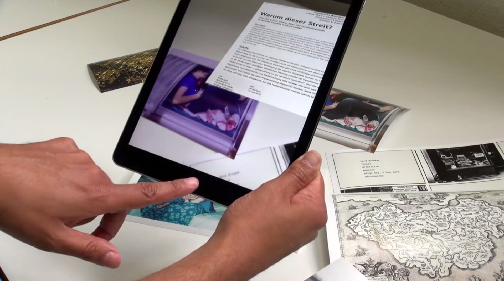

# thesisProjectVisualizer
an iOS app for iPad made for the Werkschau/Grad show of Camera Arts and Hochschule Design &amp; Kunst 2015.

The app uses simple AR technology to display the thesis summary of each student when a specific picture is framed through the device camera. Made in openFrameworks 0.8, and it requires ofxQCAR addon by julapy, a wrapper for Qualcomm's Vuforia [https://github.com/julapy/ofxQCAR].

thesisProjectVisualizer video demo: https://vimeo.com/130566793

